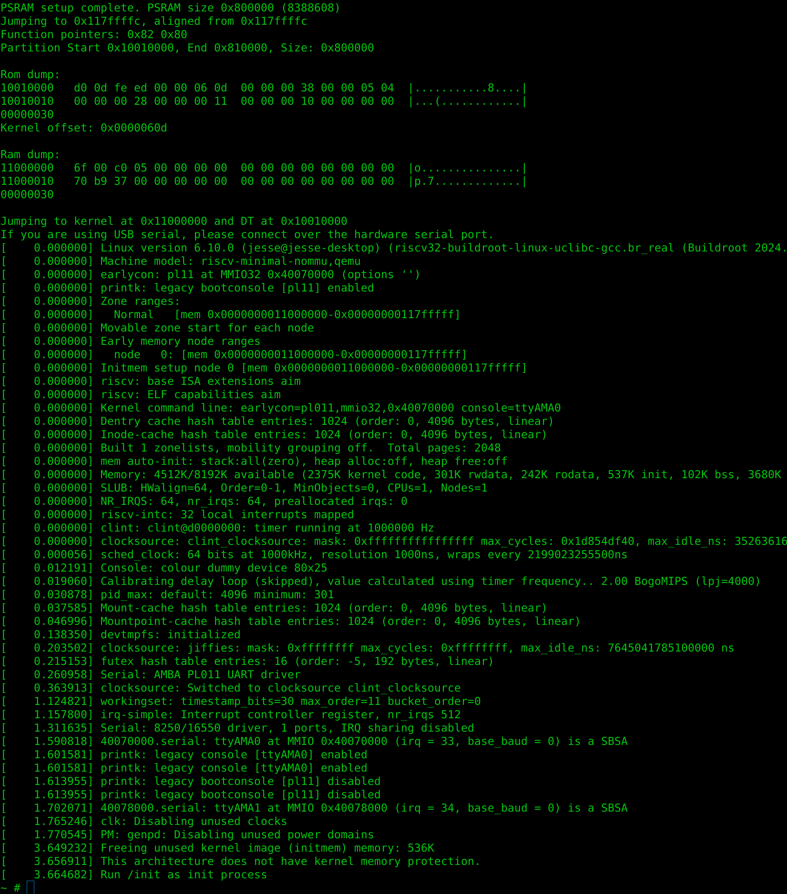

# Raspberry Pi Pico 2 Buildroot

How to build:

```bash
git clone https://github.com/Mr-Bossman/pi-pico2-linux

cd pi-pico2-linux

git submodule update --init

# cd buildroot
# make BR2_EXTERNAL=$PWD/../ raspberrypi-pico2_defconfig
make -C buildroot BR2_EXTERNAL=$PWD/ raspberrypi-pico2_defconfig

make -C buildroot

picotool load -fu buildroot/output/images/flash-image.uf2
```

## Designed to work with [SparkFun Pro Micro - RP2350](https://www.sparkfun.com/products/24870)



#### NOTES on Atomics
On page 307 of the RP2350 Datasheet MCAUSE register CODE 7 says:
> Store/AMO access fault. A store/AMO failed a PMP check, or
encountered a downstream bus error. Also set if an AMO is attempted on a
region that does not support atomics (on RP2350, anything but SRAM).

Atomics will only work in SRAM, the kernel is located PSRAM, not SRAM.
The `lr` and `sr` atomic load and store will always return error in this region causing most code using them to behave incorrectly.
Most implementations assume `lr` and `sr` will eventually succeed.

### Use on other boards

This only works on the RP2350 RISC-V cores.

If you want to run this on other boards, please change the psram CS pin with the `RP2350_XIP_CSI_PIN` macro in `package/pico2-bootloader/bootloader/src/main.c`.
As of now the only psram chip tested is the `APS6404L` and any others may not work.
